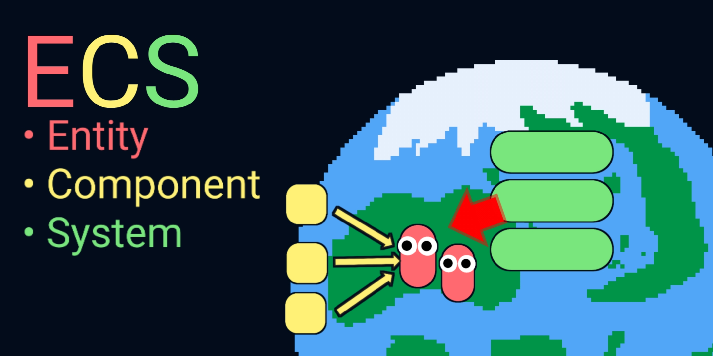

# ABOUT
Autor: Raffa064


Descrição: O projeto ECS (Entity Component System) é uma implementação minha do sistema "artemis" (So que bem mais básico)

## SETUP (do projeto)

1) Para usar é bem simples, primeiro adicione uma pasta chamada **ecs** no teu projeto (recomendo que seja na raiz, junto da pasta que geralmente é nomeada como "com")

2) Depois crie uma classe chamada **EntityFactory** no teu projeto (no pacote/pasta q você quiser, recomendo que seja no *com.empresa.app.ecs*)

> Essa classe você ira usar para criar entidades.

3) Edicione junto a classe que vc acabou de criar duas novas pastas, nomeadas como **systems** e **components**.

> Você vai usar essas pastas para colocar os sistemas e componentes que seu projeto vai precisar.

O setup ta pronto, agora é so usar.

## COMO USAR

1) Dentro da pasta **components** que criamos na sessão de  *SETUP*, crie uma classe nominada **ExampleComponent**, que devera estender a classe **Component** do pacote "ecs".

> Essa classe será um componente, ou seja, uma característica das nossas entidades.

1) Agora adicione uma variavel publica do tipo String chamada "name" a essa classe. Com isso, agente vai poder adicionar a característica de _ter um nome_ às nos entidades. 

2) Abra a classe **EntityFactory**, e adicione um atributo da class World, com o nome "world" - preste atenção para importar a classe World do pacote "ecs" - e então adicione um metodo construtor que deve receber uma instância de **World** para esse atributo.

> Isso vai facilitar o uso da EntityFactory no futuro.

1) Crie um metodo chamado createFulano, do tipo Entity (do pacote "ecs"), e dentro do mesmo, crie uma instância do tipo Entity e retorne-a. 

```
...
public Entity createFulano() {
   Entity entity = new Entity();
   return entity;
}
...
```
Apos isso, temos uma entidade pronta mas ela não possui nada e não esta dentro do nosso "world" (mundo), para resouver isso, vamos primeiro criar uma instância do nosso ExampleComponent e passar o valor do seu atributo "name" para "Fulano", e em seguida adiciona-lo à nossa entidade:

```
...
Entity entity = new Entity();

ExampleComponent example = new ExampleComponent();
example.name = "Fulano";
entity.addComponent(example);
...
```

Pronto, agora nossa entidade possui um ExampleComponent cujo atributo "name" tem o valor "Fulano", ou seja, ela agora possui as características do **ExampleComponent**, que no caso é a posse de um nome, que nos definimos como "Fulano". Agora, só nos resta adicionar essa entidade ao world usando o metodo addEntity:

```
...
public Entity createFulano() {
   Entity entity = new Entity();
   
   ExampleComponent example = new ExampleComponent();
   example.name = "Fulano";
   entity.addComponent(example);   

   world.addEntity(entity);
   return entity;
}
...
```

Prontinho!
OBS: para melhor desempenho, use o addEntity somente apos adicionar todos os componentes de sua entidade, pois o sistema do ECS atualiza as listas de entidade sempre que você ediciona ou remove componentes, tirando e colocando as entidades na lista de execução dos sistemas...

### Agora vamos criar um sistema.
Abra a pasta **systems** e adicione uma classe chamada **ExampleSystem**, que deverá estender a classe System do pacote "ecs", para menores confusões com a classe System nativa do java, faça um "import dinâmico" como abaixo: (não sei se é esse nome disso)

```
class ExampleSystem extends ecs.System {

}
```

com isso, será obrigado a implementar 4 medodos:

1) canProcess:
Esse metodo recebe uma instância de Entity, e você deverá usar o metodo contains da classe Entity nesta intância para saber se esta instância/entidade possui os componentes necessarios para que ela funcione no seu sistema, e retornar um booleano confirmando se o sistema aceita ou não esta entidade como sua responsabilidade, no caso do nosso ExampleSystem, use o código abaixo, que dirá ao ECS que este sistema so aceita entidades que possuem um ExampleComponent em sua lista* de componentes:

```
...
@Override
public canProcess(Entity entity) {
   return entity.contains(ExampleComponent.class);
}
...
```
> \* Embora eu tenha dito lista, desde as ultimas versões, as entidades usam um sistema de árvore binária, que traz uma melhor performance para o ECS

2) start:
Chamado sempre que o sistema atual é executado, antes de processar as entidades.
- No nosso exemplo não será necessario.

3) process:
Esse metodo recebe uma instância do world, uma entity, e o delta (que nada mais é do q o tempo em segundos da ultima execução (passado pelo metodo update da classe World, ou seja, isso não é automático, você mesmo devera passar essa informação...).
O metodo process é chamado para cada entidade na qual o sistema atual é responsavel. Todo sistema tem uma lista de entidades nais quais ele tem responsabilidade chamada "entities", que é populada automaticamente pela classe **World** sempre que uma entidade é alterada, adicionada ou removida.
No nosso exemplo, nos vamos pegar o componente de exemplo criado anteriormente e mostar o valor de seu atributo name no console:

```
...
@Override
public void process(World world, Entity entity, float delta) {
   ExampleComponent example = entity.getComponent(ExampleComponent.class);
	  System.out.println(example.name);
}
...
```

4) end:
Assim como o start, não iremos usar neste tutorial, mas é como se fosse o oposto do start, sendo executado sempre que todas as entidades do sistema atual forem processadas, ou seja, ao termino da execução.

Com tudo isso pronto, vamos para nossa classe Main (ou qualquer outra classe em que você esteja usando como classe principal), e criamos uma instância da classe world, e da classe EntityFactory, da seguinte forma:

```
...
World world = new World();
EntityFactory factory = new EntityFactory(world);
...
```

Tendo isso feito, vamos criar e adicionar o **ExampleSystem** e uma entidade "Fulano" ao nosso world:

```
...
ExampleSystem exampleSystem = new ExampleSystem();
world.addSystem(exampleSystem);

factory.createFulano();

//OBS: embora não seja necessário, para obter um bom desempenho, adicione todos os sistemas primeiro e só então adicione entidades, pois cada adição de entidade e sistema gera iterações no sistema...
...
```

Prontinho! Se tudo estiver certo, temos um sistema e uma entidade adicionados ao nosso *world*, agora so falta atualizar o nosso World:

```
...
world.update(0); //O parametro delta pode ser 0, caso voce não saiba o que é, ou se não vai usar
...
```

Ao executar, se tudo correr bem, estara escrito "Fulano" no console.

## Outras informações:
- Agora a BinaryTree não inicia com uma root padrão, ou seja, o primeiro *put* define a raiz.
- Após a ultima alterações no BinaryTree, o metodo **put** retorna **int**, sendo:
- - 0 quando você tenta usar 2 chaves iguais;
- - 1 quando tudo ocorrer bem.
- O World.update tem que ser executado a cada frame, para que todos os sistemas sejam executados e atualizados.
- O World internamente atualiza sozinho todos os sistemas sempre que uma entidade é adicionada/atualizada/removida, e o mesmo ocorre caso você adicione um sistema após o inicil da execução, ou seja, sempre, amenos que você cause alguma interferencia, os sistemas estarão sempre atualizados.
- O uso da classe EntityFactory é so um tipo de *design pattern* padrão desse tipo de sistema mas não é obrigatório, e seu objetivo é organizar os codigos para criação de entidades.
- Após as ultimas atualizações, as entidades armazenam os components numa *Binary tree*, o que melhora o desemprenho ja que o getComponent custuma ser chamado pelomenos 1 vez para cada sistema.

